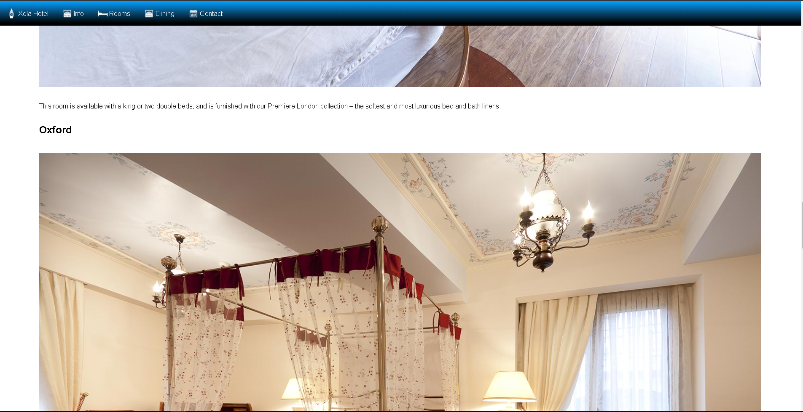

# HTML-CSS Esencial (Práctica 1)

## Github Pages:

Enlace:
[Github-Pages ]()

## Capturas de Pantalla:

### Home:

### Info page:

### Rooms: 

### Contact: 

### Dinning:

### Dificultades:
- Manejo de los branchs, pero se que es falta de practica.
- Idearmelas para utilizar las mismas clases en las diferentes secciones.
- Utilizar la metodologia BEM, ya que hace tiempo no la usaba.
### Validación de Código:
